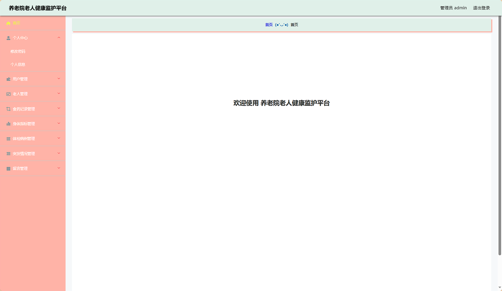
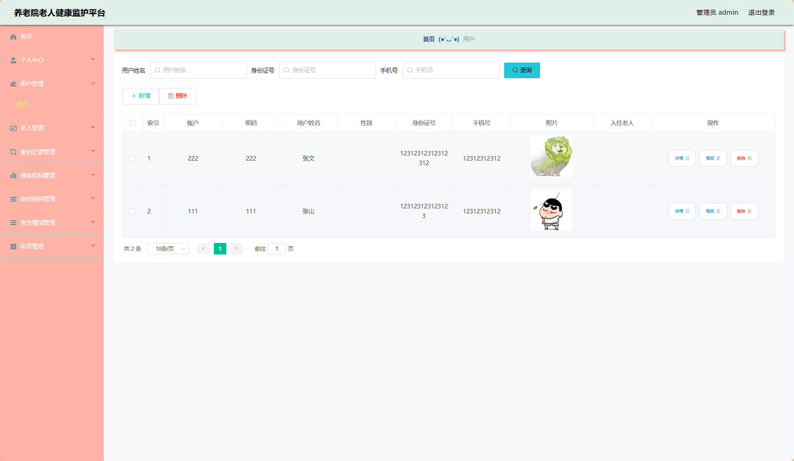
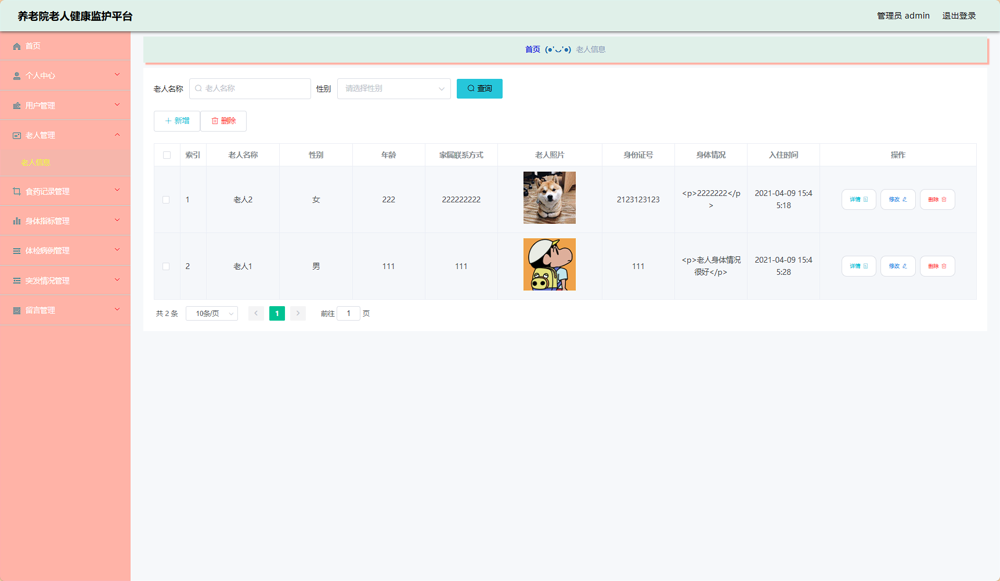
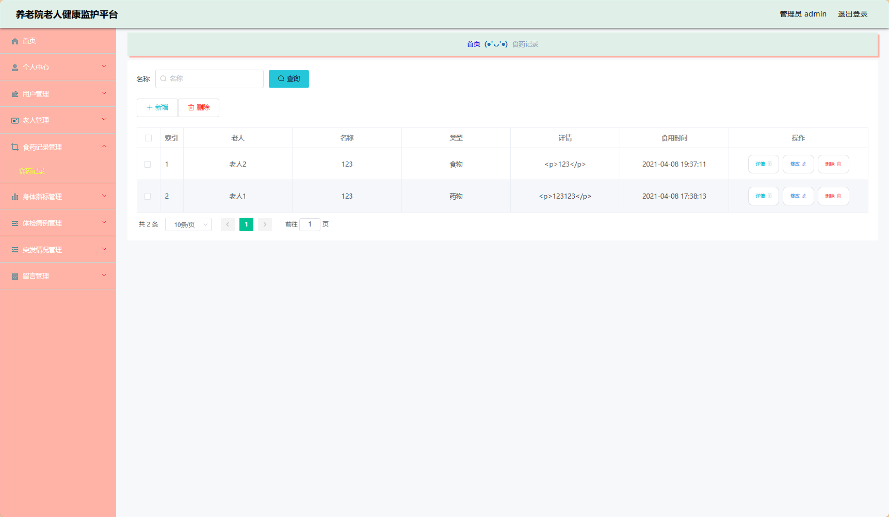
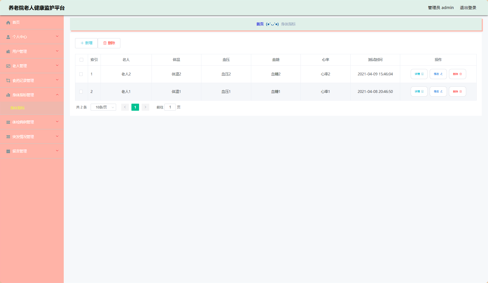
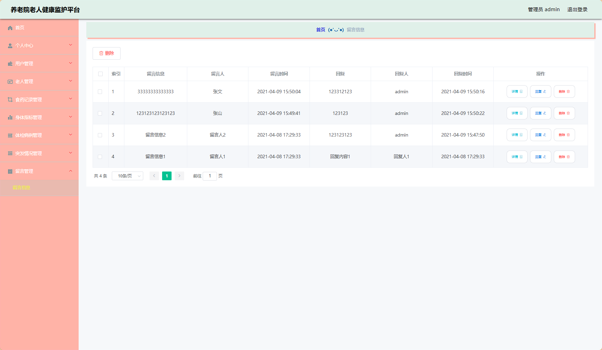
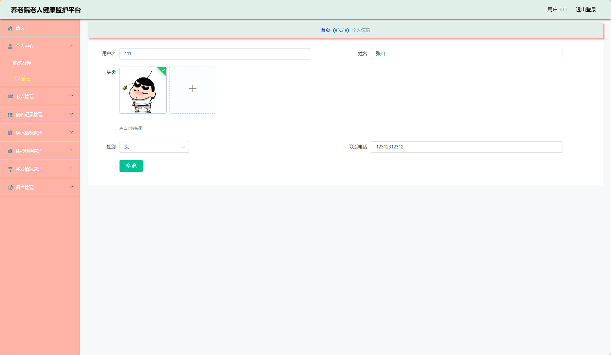

# ssm173养老院老人健康监护平台 / ssm173-elderly-health-monitoring


> 更多毕设项目可跳转至项目导航栏检索：[毕设项目](http://sysadmin.3vfree.vip)，需要联系博主v：xq-lucky311，q：1047944234

## 项目简介  
基于SSM（Spring+SpringMVC+MyBatis）架构的养老院健康管理系统，整合MyBatis-Plus增强ORM操作，实现老人健康档案管理、体检病例追踪、突发情况预警等核心功能，支持文件上传和百度AI接口集成。


- ​**​Spring Framework 5.0.0​**​：IoC容器与AOP编程
- ​**​MyBatis-Plus 2.3​**​：自动生成基础SQL语句
- ​**​MySQL 8.0.33​**​：关系型数据库存储
- ​**​Druid 1.1.0​**​：数据库连接池监控
- ​**​Bootstrap/jQuery​**​：前端交互框架
- ​**​Hutool 4.0​**​：通用工具库

## 特征介绍
- ​​**​健康监测闭环​**​：完整记录体温/血压/血糖/心率等身体指标时序数据
- ​​**​多维度档案管理​**​：集成食药记录、体检报告、突发情况三组健康维度数据
- ​​**​智能鉴权体系​**​：基于自定义注解(@LoginUser)实现接口权限控制
- ​​**​文件云存储​**​：支持体检报告PDF、老人照片等文件上传管理
- ​​**​百度AI集成​**​：通过百度云接口实现智能健康数据分析
- ​​**​日志追踪​**​：Log4j记录系统操作日志，配置多环境日志策略
- ​​**​数据字典​**​：独立字典模块维护性别/健康状态等枚举类型

## 代码结构
```
src/
├── main/
│   ├── java/
│   │   ├── com/
│   │   │   ├── annotation/          # 鉴权注解(LoginUser/IgnoreAuth)
│   │   │   ├── config/              # MyBatis元数据处理器
│   │   │   ├── controller/          # REST接口层(老人/留言/文件)
│   │   │   ├── dao/                 # 数据访问层(包含XML映射)
│   │   │   ├── entity/              # JPA实体+VO/Model分层设计
│   │   │   ├── interceptor/         # 权限验证拦截器
│   │   │   ├── service/             # 业务服务层+实现类
│   │   │   ├── utils/               # 百度AI/文件操作工具类
│   ├── resources/
│   │   ├── mapper/                  # MyBatis动态SQL配置
│   │   ├── spring/                  # 三大Spring配置文件
│   │   ├── config.properties        # 数据库连接配置
│   │   ├── log4j.properties         # 日志级别配置
│
├── webapp/
│   ├── admin/                       # 后台管理界面
│   ├── resources/                  # 前端静态资源
│   │   ├── bootstrap/               # Bootstrap样式库
│   │   ├── jquery/                  # jQuery交互库
│   ├── upload/                     # 文件存储目录
```
## 使用说明
1. 数据库配置：
   修改`/src/main/resources/config.properties`：
   ```properties
   jdbc_url=jdbc:mysql://localhost:3306/yanglaoyuanlaorenjiangkang
   jdbc_username=root
   jdbc_password=123456
   ```
2. 访问地址：
   后台系统：http://localhost:8080/yanglaoyuanlaorenjiangkang/admin/dist/index.html#/login
   默认账号：
      管理员：admin/admin
      普通用户：111/111 或 222/222

3. 文件存储：
   图片上传路径：src/main/webapp/upload
   禁止使用中文文件名

4. 健康数据录入：
   体温/血压等指标通过ShentizhibiaoController接口提交
   体检报告PDF通过FileController上传
```

# 项目实际截图：

## 后台：








> 等等...

# 精选项目导航 & 快速部署工具
## 项目资源一站直达
- ​**访问项目导航站**：[点击进入](http://sysadmin.3vfree.vip)**快速检索所需项目名称**
- ​**技术栈全覆盖**：Java/SSm/Spring Boot/小程序等主流技术方案
- ​**配套资源**：每个项目均提供部署文档 + 演示视频（附效果截图）

### ▌导航站预览


### ▌工具界面预览


## 捐赠
> 博主将持续更新Java全栈开发项目，包含ssm，springboot，前后端分离系统等项目。
> 此外如果您够宽裕，请博主喝杯咖啡吧！捐赠将用于服务器维护与开源社区建设，感谢您的认可！
> 如需更多Java相关项目毕设3000+，有其他项目需求，sql文件等可联系博主v:xq-lucky311

---